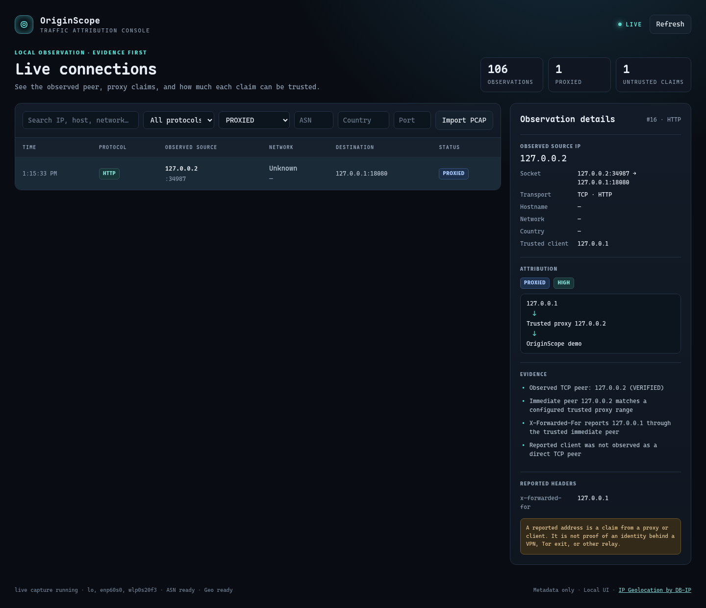

# OriginScope

OriginScope is a local network traffic attribution prototype. It shows the IP address that reached your machine, the route a trusted HTTP proxy reports, and the evidence behind each claim. It does **not** reveal an identity hidden behind a VPN, Tor exit, NAT, or relay.



## Quick start

Linux with Python 3.11+, `tshark`, and capture permission is recommended. Fedora:

```sh
sudo dnf install wireshark-cli python3
sudo usermod -aG wireshark "$USER"
# Log out and back in once, or use sg as shown below.
./scripts/setup.sh
./originscope
```

On the first run after joining the group, use `sg wireshark -c './originscope'` if you have not logged out yet. The app itself runs as your user. Fedora's Wireshark package grants the narrow network capabilities to `dumpcap`, which is accessible only to the `wireshark` group. See [Wireshark's capture permission guide](https://wiki.wireshark.org/capturesetup/captureprivileges).

Open **http://127.0.0.1:18765**. Run from the project directory. `./originscope` is the single startup command after installation. Stop it with Ctrl+C.

If `tshark` or capture permission is missing, the UI and HTTP demo still run. The backend explains the capture failure and polls `ss` for established local TCP sockets. That fallback cannot see UDP or very short lived sockets. PCAP import requires `tshark`.

The setup script creates `.venv`, installs PyYAML and `maxminddb`, and downloads local Cloudflare ranges, Tor exit addresses, and DB-IP Lite ASN/country databases. Later starts do not need internet. Refresh data with `.venv/bin/python scripts/update_data.py`. Data files are intentionally excluded from Git; setup downloads them for a new checkout. `config.yaml` is editable. The documented default ports are 18765 (UI), 18080 (test server), and 18081 (test proxy).

## Try attribution

While OriginScope is running, send these requests in another terminal:

```sh
curl http://127.0.0.1:18080/direct
curl -H 'X-Forwarded-For: 203.0.113.9' http://127.0.0.1:18080/spoof
curl -H 'X-Forwarded-For: 203.0.113.9' http://127.0.0.1:18081/via-proxy
```

The first is **DIRECT** with observed TCP peer `127.0.0.1`. The second is **UNTRUSTED HEADER**: `203.0.113.9` is displayed as a claim and never accepted as the client. The third is **PROXIED**: the built-in proxy removes supplied attribution headers, forwards the request from `127.0.0.2`, and reports its observed client as `127.0.0.1`. Only `127.0.0.2/32` is trusted by default. This separate loopback address keeps a direct `127.0.0.1` request from accidentally becoming trusted.

The test server returns a JSON explanation and adds the event to the live UI. Click a row to see the observed source, reported headers, accepted client if any, topology, confidence, and evidence. Use the search, protocol, source classification, ASN, country, and destination port filters. Use **Import PCAP** to load a `.pcap` or `.pcapng` up to 50 MiB; imported connection starts use the same parser and enrichment pipeline.

## Architecture and reused components

```text
Network interface ── TShark / dumpcap ── field output ──┐
PCAP / PCAPNG ──────── TShark ─────────── field output ──┼─ normalize + deduplicate
HTTP demo ─────────── Python HTTP server ────────────────┘          │
                                                                  ├─ trust rules + evidence
                                                                  ├─ local DNS / MMDB / lists
                                                                  └─ bounded memory → SSE → browser
```

| Candidate | MVP fit | Decision |
| --- | --- | --- |
| [TShark / Wireshark](https://www.wireshark.org/docs/man-pages/tshark) | Live capture, protocol fields, PCAP and PCAPNG import; [GPLv2+](https://www.wireshark.org/about.html) separate executable | **Use**; no packet decoder in OriginScope |
| [tcpdump / libpcap](https://www.tcpdump.org/) | Solid capture, less convenient structured protocol output | Installed backup option, no adapter needed |
| [Zeek](https://zeek.org/) and [Suricata](https://suricata.io/) | Rich network telemetry, larger deployment and configuration surface | Skip for a single-machine MVP |
| [nDPI](https://github.com/ntop/nDPI) | Deep protocol classification | Skip until the TShark protocol guess proves insufficient |

The app is Python standard library plus PyYAML for editable YAML and `maxminddb` for local MMDB lookups. The browser UI uses native HTML, CSS, JavaScript, and Server-Sent Events. There is no database, cloud service, framework, or payload store. `ss` is a reduced fallback when packet capture is unavailable.

## Trust model

The observed source is the peer visible at this host; it is always shown separately from claimed client addresses. `Forwarded` ([RFC 7239](https://datatracker.ietf.org/doc/html/rfc7239)), `X-Forwarded-For`, `X-Real-IP`, `CF-Connecting-IP`, and `True-Client-IP` are displayed as evidence. A claim is accepted only if the immediate TCP peer belongs to a configured `trusted_proxies` CIDR. For `Forwarded` and `X-Forwarded-For`, OriginScope walks from the closest hop backwards and stops at the nearest untrusted address. `CF-Connecting-IP` is accepted only when the peer also matches the downloaded Cloudflare ranges. Cloudflare's [header guidance](https://developers.cloudflare.com/fundamentals/reference/http-headers/) explains that header's meaning.

**A trusted proxy must remove untrusted incoming attribution headers and write its own.** Trusting a proxy IP without controlling its header behavior can still admit spoofed claims. The included proxy does this. A local process can also bind `127.0.0.2`, so the loopback demo is a teaching fixture, not a security boundary. For production, place the origin behind a network boundary that accepts traffic only from the intended proxy.

`config.yaml` controls the capture interface, ports, trusted proxy CIDRs, history cap, enrichment, and data paths. It never grants automatic trust to all Cloudflare ranges: the downloaded list classifies an observed peer, while trust requires explicit configuration. No origin is inferred behind a Tor exit or other relay. A Tor label means only that the observed peer matched the local exit list at the time it was downloaded.

## Data, privacy, and limitations

- [DB-IP Lite](https://db-ip.com/db/lite.php) ASN/country data is **CC BY 4.0**, updated monthly, with reduced accuracy and coverage. Attribution is in this README and the UI. The local files are unmodified copies. Country is an estimate, not proof of a person's location. The ASN organization is a network owner and may differ from the retail ISP.
- Cloudflare publishes its [IPv4](https://www.cloudflare.com/ips-v4) and [IPv6](https://www.cloudflare.com/ips-v6) ranges. The [Tor Project bulk exit list](https://check.torproject.org/torbulkexitlist) is a snapshot and does not include every possible relay or destination-specific exit policy. Refresh these files regularly.
- No packet bodies, cookies, credentials, TLS plaintext, or HTTP message bodies are stored by OriginScope. TShark inspects traffic transiently to report metadata. Imported PCAP files can contain sensitive payloads supplied by the operator; OriginScope holds the uploaded bytes in a temporary file only while TShark reads them, then deletes it. Do not import captures you are not authorized to analyze.
- The UI and test servers bind to `127.0.0.1` by default. Changing that exposes unauthenticated local endpoints; add your own access control before binding publicly.
- One event represents a TCP connection start or first UDP datagram in a 30-second flow window. This keeps the UI usable under high packet rates; it is not a packet counter. The in-memory history is capped at 10,000 observations and disappears on restart.
- Reverse DNS can be absent or misleading. The lookup worker has a two-second timeout and never blocks capture. Offline lists and databases keep ASN/country/Tor/CDN enrichment available without an API request for each observed IP.
- PROXY protocol v1/v2 ingestion, STUN/TURN/ICE analysis, TLS interception, VPN detection, and relay deanonymization are outside this MVP. The UI reports **UNKNOWN** when evidence is insufficient.

## Verification

```sh
.venv/bin/python -m unittest -v test_app.py
curl -fsS http://127.0.0.1:18765/api/status
```

The included checks cover untrusted headers, trusted proxy hop selection, Cloudflare header gating, and malformed TShark records. For manual verification, run the three demo requests above, check the live table and detail panel, and import a PCAP captured on an interface you may monitor. A screenshot of the tested proxy detail view is included above.

## Project files

`app.py` is the backend, `static/index.html` is the UI, `config.example.yaml` is the configuration template, `scripts/setup.sh` installs local dependencies, and `scripts/update_data.py` refreshes public datasets. `readme.txt` is the requested implementation plan; `progress.txt` records verified progress.
